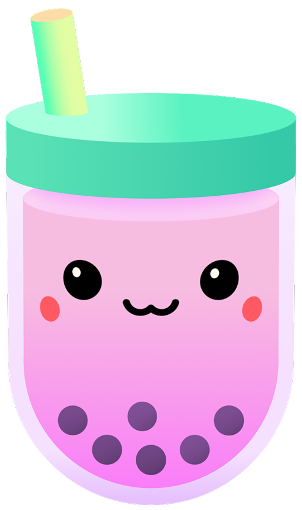

  

<h1 align="center">
  Bubble Tea Theme for VS Code
</h1>

  A delightful, cute, and modern theme for Visual Studio Code, inspired by the sweet and refreshing world of Bubble Tea, and drawing its color palette from the standard colors used in the amazing Charmbracelet projects like Bubble Tea and Lipgloss.

## ✨ Features

- **Soothing Colors**: A carefully selected color palette that is easy on the eyes, perfect for long coding sessions.
- **Visual Debugging**: Colors are chosen to facilitate visual debugging, making it easier to spot issues.
- **Focus on What Matters**: The design reduces "scan time" by highlighting important elements and deemphasizing distractions.
- **Comprehensive Syntax Highlighting**: Enhanced readability across a wide range of languages.
- **Custom Icon Pack**: Over 200 custom file and folder icons to give your workspace a unique and consistent look.
- **Minimalist & Clean UI**: A decluttered interface that helps you focus on what matters: your code.

## 📸 Screenshots

## 📦 Installation

1.  Open **Visual Studio Code**.
2.  Go to the **Extensions** view (`Ctrl+Shift+X` or `Cmd+Shift+X`).
3.  Search for `Bubble Tea Theme`.
4.  Click **Install**.
5.  Go to **File > Preferences > Theme > Color Theme** and select **Bubble Tea Theme**.
6.  (Optional) Go to **File > Preferences > Theme > File Icon Theme** and select **Bubble Tea Icons**.

## 👨‍💻 Author

This theme was created with 🐧 by **Henriquehnnm**.

- **GitHub**: [@Henriquehnnm](https://github.com/Henriquehnnm)

## 📜 License

This project is licensed under the [MIT License](LICENSE).
